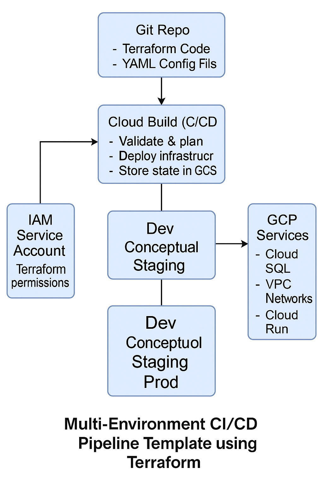

# Multi-Environment CI/CD Pipeline Template using Terraform

## Overview
A reusable Terraform-based infrastructure provisioning and CI/CD pipeline template for multi-environment GCP deployments.

## Features
- Infrastructure as Code using modular Terraform.
- Cloud Build for automated pipeline execution.
- Centralized state with GCS.
- Dev/staging/prod environment separation.
- Drift detection using Cloud Functions.

## Stack
- Terraform
- Google Cloud Build
- Google Cloud Storage
- IAM
- YAML, Bash
- Cloud Functions

## Architecture

## Getting Started
- Clone the repo and configure environment variables
- Use `terraform init` and `terraform apply`
- Integrate Cloud Build with GitHub triggers
